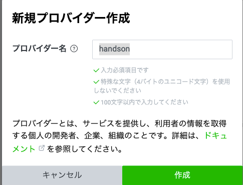
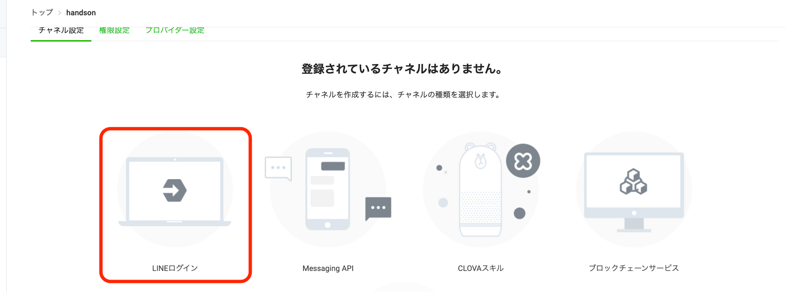
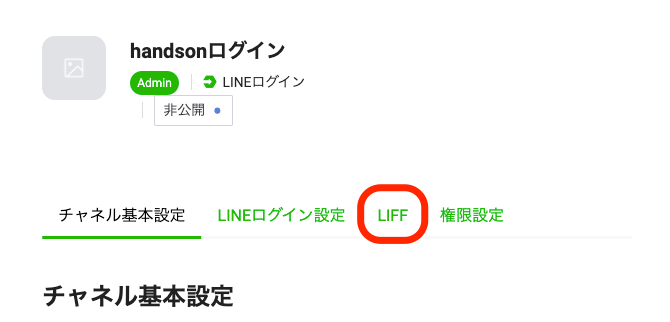

author: takahiro izumikawa
summary: LIFFアプリをFirebaseで動かすハンズオンです
id: izumix03-20210513_liff_with_firebase_handson
categories: codelab,markdown
environments: Web
status: Draft
feedback link: https://github.com/izumix03/liff_firebase_handson
analytics account: G-DC76XXBQMH

# LIFFアプリをFirebaseで動かすハンズオン

## LINE公式アカウント作成
Duration: 0:03:00

### LINE Developersへのアカウント登録

[LINE Developers](https://account.line.biz/login?redirectUri=https%3A%2F%2Fdevelopers.line.biz%2Fconsole%2F)コンソールで[コンソール]もしくは[ログイン]をクリックします。


LINEアカウントのメールアドレスとパスワードを入力し、ログインしてください。

## 新規プロバイダー作成
Duration: 0:03:00

開発者の所属となるプロバイダーを作成します。プロバイダーの[作成]ボタンをクリック

個人開発者ですのでプロバイダー名は本名でもニックネームでも任意で設定してください。



## チャネル（LINEログイン）作成
Duration: 0:03:00

LIFFアプリのためにLINEログインチャネルを作成します。




|  チャネルの種類  |  LINEログイン  |
| ---- | ---- |
|  プロバイダー  |  handson(任意)  |
|  地域  |  日本  |
|  チャネルアイコン  |  (任意)  |
|  チャネル名  |  handsonログイン(任意)  |
|  チャネル説明  |  handsonログイン(任意)  |
|  アプリタイプ  |  ウェブアプリ  |
|  メールアドレス  |  (自分のメールアドレス)  |
|  プライバシーポリシーURL  |  (任意)  |
|  サービス利用規約URL   |  (任意)  |


## LIFFの設定
Duration: 0:03:00

LIFFの設定を行います。



|  LIFFアプリ名  |  handson-liff(任意)  |
| ---- | ---- |
|  サイズ  |  Full(任意)  |
|  エンドポイントURL  |  https://example.com (任意)  |
|  Scope  |  profile  |
|  ボットリンク機能  |  On (Aggressive)  |
|  オプション  |  (なし)  |

エンドポイントURLは後ほど書き換えます。

Scope ではIDトークン使いたい場合 `openid` も選択しましょう。
※今回のハンズオンでは `profile` しか使いません。

## Firebase 設定
Duration: 0:10:00

### プロジェクト作成

Google アカウントで Firebase のサイトを開き、プロジェクトを作りましょう。
https://console.firebase.google.com/


|  プロジェクト名  |  handson-liff(任意)  |
| ---- | ---- |
|  このプロジェクトで Google アナリティクスを有効にする  |  無効  |


### Webアプリを追加

|  アプリのニックネーム  |  handson-liff(任意)  |
| ---- | ---- |
|  hosting  |  利用する  |

### ローカルにコードを準備

個人アカウントに切り替えるなど忘れずにしましょう。

```shell
yarn global add firebase-tools
exec $SHELL -l
firebase login --reauth
```

```shell
# コードを置きたディレクトリを作りましょう
mkdir XXX
cd XXX
firebase init --project {project名}
```

まず使うサービスを聞かれるので、
Functions, Hosting, Emulators を選択します。

```shell
? What language would you like to use to write Cloud Functions? TypeScript
? Do you want to use ESLint to catch probable bugs and enforce style? Yes
✔  Wrote functions/package.json
✔  Wrote functions/.eslintrc.js
✔  Wrote functions/tsconfig.json
✔  Wrote functions/src/index.ts
✔  Wrote functions/.gitignore
? Do you want to install dependencies with npm now? No

=== Hosting Setup

Your public directory is the folder (relative to your project directory) that
will contain Hosting assets to be uploaded with firebase deploy. If you
have a build process for your assets, use your build's output directory.

? What do you want to use as your public directory? hosting/build
? Configure as a single-page app (rewrite all urls to /index.html)? No
? Set up automatic builds and deploys with GitHub? No

=== Emulators Setup
? Which Firebase emulators do you want to set up? Press Space to select emulators, then Enter to con
firm your choices. Authentication Emulator, Functions Emulator, Hosting Emulator
? Which port do you want to use for the auth emulator? 9099
? Which port do you want to use for the functions emulator? 5001
? Which port do you want to use for the hosting emulator? 5000
? Would you like to enable the Emulator UI? Yes
? Which port do you want to use for the Emulator UI (leave empty to use any available port)? 
? Would you like to download the emulators now? No

i  Writing configuration info to firebase.json...
i  Writing project information to .firebaserc...
i  Writing gitignore file to .gitignore...

✔  Firebase initialization complete!
```

### hostingのコードをReactで用意

```shell
rm -rf hosting
npx create-react-app hosting --template redux-typescript
```

## 動作確認とデプロイ
Duration: 0:05:00

### ローカルで起動
まずはローカル起動しましょう。

```shell
# hosting
yarn start
```

動きましたね。
ではビルドしてhostingのemulatorも確認しましょう。

```shell
# hosting
yarn build
firebase emulators:start
```

動作確認できましたね。

ではデプロイしてみましょう。

```shell
firebase deploy --only hosting
```

動作確認できましたね。

## LIFFアプリを実装準備
Duration: 0:10:00

```shell
# hosting
rm -rf src/features/counter
```

#### □不要なコードを編集

まず不要なコードを削除します。

```shell
# hosting
rm -rf src/features/counter
rm -f src/App.test.tsx
rm -f src/App.css
```

※テストなんかいらないという意味ではありません。
 App.tsxを書き換えるのですが、テストはここで説明しないので削除しています。

`hosting/src/app/store.ts`
```diff:hosting/src/app/store.ts
-import counterReducer from '../features/counter/counterSlice';

-    counter: counterReducer,
```

`hosting/src/App.tsx`
```typescript:hosting/src/App.tsx
import React from 'react';

export const App = () => {
  return (
    <div className="App"></div>
  );
}
```

```shell
# hosting
yarn add firebase axios @line/liff
# 今回説明しませんが、デザインしたい方は以下もいれましょう
# yarn add @material-ui/core @material-ui/icons
```

## LIFFアプリを実装
Duration: 0:05:00

### Firebaseを使えるようにしましょう

普通`.env` に記載して使うと思いますが、今回直接記載しています。

```shell
# hosting
mkdir src/configs
touch src/configs/firebaseApp.ts
```

`hosting/src/configs/firebaseApp.ts`
```typescript:hosting/src/configs/firebaseApp.ts
import firebase from 'firebase/app';
import 'firebase/auth';

const firebaseConfig = {
  apiKey: "XXXX",
  authDomain: "XXXX",
  projectId: "XXXX",
  storageBucket: "XXXX",
  messagingSenderId: "XXXX",
  appId: "XXXX"
};

const firebaseApp = firebase.initializeApp(firebaseConfig);
export const auth = firebaseApp.auth();
```

`firebaseConfig` の内容はコンソールから確認できます。
Firebaseのコンソールから プロジェクトの設定 を進みましょう。
全般 タグの下の方にSDKの設定と構成という項目があるので、 そこで構成を選択するとコピーできます。

また、今回はやりませんが、Firestoreを使って単体テストも書く場合などは、
プロバイダーにするのがオススメです。

### ログインさせて表示を変更するロジック

`hosting/src/App.tsx`
```typescript:hosting/src/App.tsx
import React from 'react';
import { useUser } from './hooks/useUser';

export const App = () => {
  const [user] = useUser();

  return (
    <>
      { user? (<p>認証完了</p>) : (<p>未認証</p>) }
    </>
  )
}
```

`hosting/src/index.tsx' がエラーしていると思うので、修正して下さい。

本当はApp.tsxはルーティングと共通デザインだけ管理すると思いますが、
今回はここに直接書いてしまいます。

まだ `useUser` を作っていないので現状はエラーします。

では独自フックでログイン処理を書きましょう。

```shell:hosting
# hosting
mkdir src/hooks
touch src/hooks/useUser.ts
```

`hosting/src/hooks/useUser.ts`
```typescript:hosting/src/hooks/useUser.ts
import {useContext, useEffect, useRef, useState} from 'react';
import firebase from 'firebase/app';
import liff from '@line/liff';
import axios from 'axios';
import { auth } from '../configs/firebaseApp';

const liffId = 'XXXXX';

export const useUser = () => {
  const [user, setUser] = useState<firebase.User | null>(null);

  useEffect(() => {
    let unmount = false;

    const unSub = auth.onAuthStateChanged(async authUser => {
      await liff.init({ liffId });
      if (!liff.isLoggedIn()) {
        await liff.login()
        return
      }

      if (authUser && !unmount) {
        setUser(authUser)
        return
      }

      const accessToken = liff.getAccessToken();
      if (!accessToken) return;

      const result = await axios.post('/login', { accessToken });
      if (result.data.error) {
        console.error('functions error', result.data.error);
        return
      }

      const res = await auth!.signInWithCustomToken(result.data.token);
    })

    return () => {
      unmount = true;
      unSub();
    }
  }, []);

  return [user] as const;
}
```

`liffId` というのが出てきました。
LINEログインを使うために必要なので先程作ったLIFFアプリの画面からコピーしてきましょう。

### firebase.json を編集
axiosで `/login` にアクセスしていますね。
hostingのパスをfunctionsに向けて処理させるために書いています。
firebase.jsonを編集しましょう。

```diff:firebase.json
  "hosting": {
    "public": "hosting/build",
    "ignore": [
      "firebase.json",
      "**/.*",
      "**/node_modules/**"
-    ],
+    ],
+    "rewrites": [
+      {
+        "source": "**",
+        "destination": "/index.html"
+      },
+      },
+      {
+        "source": "/login",
+        "function": "loginUsCentral"
+      }
+    ]
  },
```

これでhostingを使ったフロントの処理は終わりです。

### デプロイ
```shell
firebase deploy --only hosting
```

## Firebase Functionsを実装
Duration: 0:05:00

LINEのアクセストークンを受け取り、
LINEのプロフィールを取得し、
Firebase Authenticationのカスタムトークンを発行するという処理を行います。

シンプルにするために何も工夫せず書きます。

### 必要なライブラリをインストール
```shell:functions
# functions
yarn add axios firebase-admin firebase-functions
```

`functions/src/index.ts`
```typescript:functions/src/index.ts
import * as admin from 'firebase-admin';
import * as functions from 'firebase-functions';
import axios from 'axios';

// サービス アカウント JSON ファイル
import serviceAccount from './config/serviceAccountKey.json';

const channelId = 'XXXX';

admin.initializeApp({
  credential: admin.credential.cert(serviceAccount as admin.ServiceAccount),
});

const axiosInstance = axios.create({
  baseURL: 'https://api.line.me',
  responseType: 'json',
});

const verifyToken = async (accessToken: string) => {
  const response = await axiosInstance.get('/oauth2/v2.1/verify', {
    params: { access_token: accessToken },
  });

  if (response.status !== 200) {
    console.error(response.data.error_description);
    throw new Error(response.data.error);
  }

  if (response.data.client_id !== channelId) {
    throw new Error('client_id does not match.');
  }

  if (response.data.expires_in < 0) {
    throw new Error('access token is expired.');
  }
};

const getProfile = async (accessToken: string) => {
  const response = await axiosInstance.get('/v2/profile', {
    headers: {
      Authorization: `Bearer ${accessToken}`,
    }
  });

  if (response.status !== 200) {
    console.error(response.data.error_description);
    throw new Error(response.data.error);
  }

  return response.data;
};

exports.loginUsCentral = functions
  .region('us-central1')
  .https.onRequest(async (req, res) => {
    const { accessToken } = req.body;

    if (!accessToken) {
        res.status(400).send({ error: 'invalid access' });
        return;
    }

    try {
      await verifyToken(accessToken);
      const profile = await getProfile(accessToken);
      const token = await admin.auth().createCustomToken(profile.userId);

      res.send({ token });
    } catch (e) {
      console.error(JSON.stringify(e, null, '  '));

      res.status(500).send({ error: e.message });
    }
  });
```

channelIdはLINEログインのチャネルIDを入れて下さい。
`serviceAccountKey.json` はFirebaseコンソールからサービスアカウントのjsonを作成して保存し、リネームして使って下さい。

※rewrite するためにはリージョンが us-central1 である必要があるので、
`.region('us-central1')`としています。

### デプロイ
```shell
firebase deploy --only functions
```

## エンドポイント設定
LIFFのエンドポイントURLをhostingのURLに書き換えましょう！

これで終了です！